# Big data projects using HDFS and MapReduce
## 1. Movie Recommender System
### MapReduce | Hadoop | AWS
#### Algorithm chosen: Item CF
A form of collaborative filtering based on the similarity between items
calculated using people's ratings of those items

Reasons of Item CF instead of User CF:

● The number of users weighs more than number of products  
● Item will not change frequently, lowering calculation  
● Using user’s historical data, more convincing  
● One cannot say two people are similar in movie taste just based on the movies they watch - people tend to be more "changable" and "unstable"  

#### How to define the similarity between two movies?
One can perform a covarience matrix on movies while the value will be the rating and row will be user.   
Or simply perform a correlation on one movie vector with the whole matrix to find the correlations between this movie and other movies.  
#### BUT!
As we can imagine, most users only watched part of the movies in the movie set of our data, which means we will have a very sparse matrix.
When the size of the data is very big, it's not memory-efficient to store such a large sparse matrix, not to mention performing matrix multiplication on it. -> crash our machine. Then what now?

#### Co-occurance matrix
A co-occurrence matrix is a matrix that is defined over an image to be the distribution of co-occurring pixel values (grayscale values, or colors) at a given offset.  

We define if user rates two movies together, we consider them similar. Then we can build a N * N co-occurance matrix, with rows and columns are movies.   
Note: we make it directional, meaning, movieA -> movieB and movieB -> movieA are not the same. (Easy to understand, the purpose behind watching movieB after watching movieA is not the same as watching movieA after watching movieB)  
 
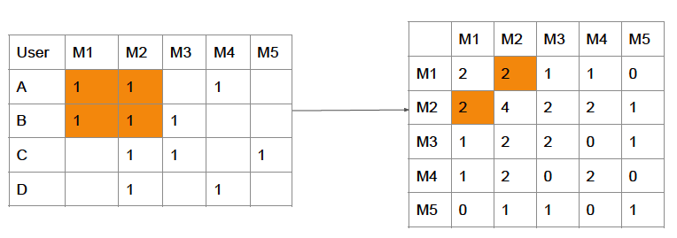

#### Rating matrix
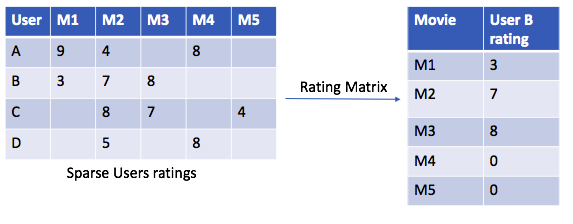 
 
It is a vector of movies containing the rating for each of them. And these are all come from one user.

#### Co-occurance matrix * Rating matrix
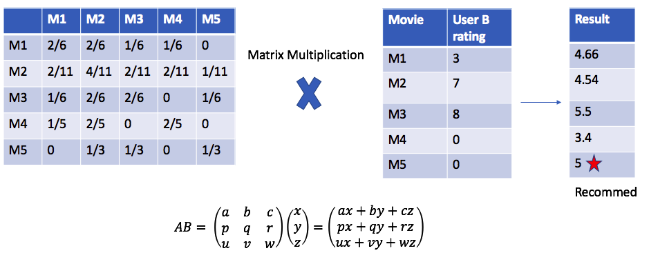

### Proces Flow
#### Data preprocessing
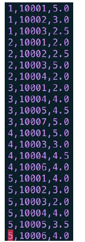 
Raw data into data format of each row:  
userId,movieId,rating  
("," as separator)  
#### 5 MapReduce Jobs
##### 1st MapReduce Job
Parse input data:  
Mapper output key=userId, value=(movieId, rating)  
 
 
 
Reducer put all movie and rating tuples into a list and output
key=userId, value=[(movieId1, rating1), (movieId2, rating2),...]  
 
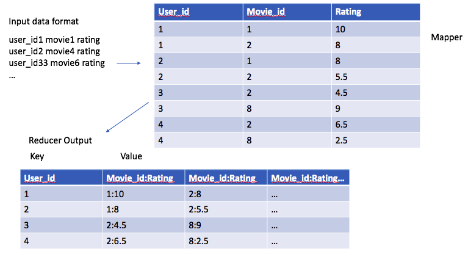 

##### 2nd MapReduce Job
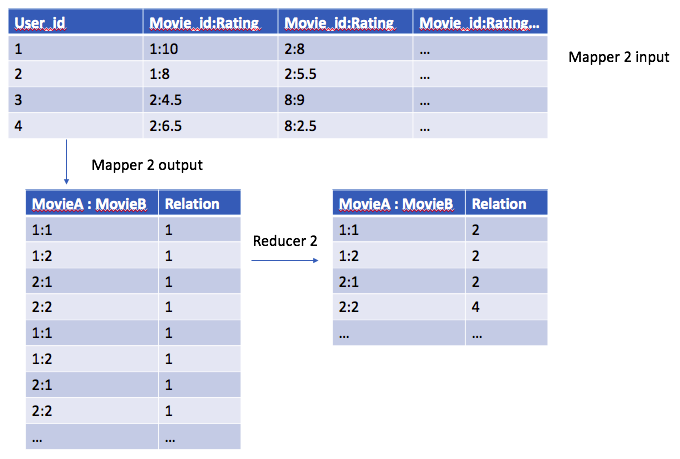
 
 
Construct co-occurance matrix  
Input from the output of last MapReduce job: key=userId, value=[(movieId1, rating1), (movieId2, rating2),...]  
 
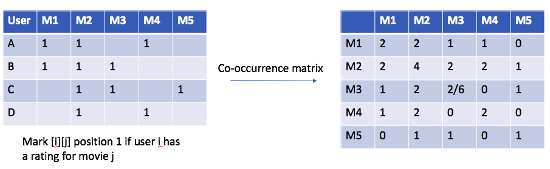
  
Mapper output: key=(movie1,movie2), value=1 (means occurance=1) AND key=(movie2,movie1), value=1 (bi-directional)   
Reducer: count the total occurance of each movie pair (key=(movie1,movie2)), output key=(movie1,movie2), value=sum(values), values are the list from mapper containing "1"s.  
###### Noted:
Another way to calculate similarity is we can use cosine similarity for each pair of movies. (Can be further evaluated to see which one has the most robust recommendation) 
##### 3rd MapReduce Job
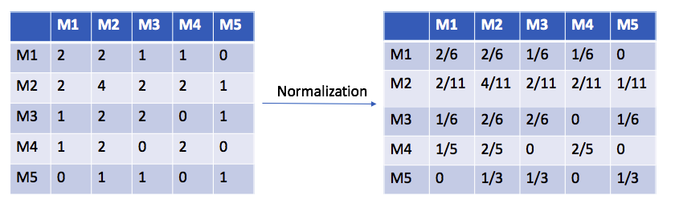  
##### Normalization
Normalize for each row (to have a summation to 1) so that it has weights for each movies in the column for later multiplying a movie vector to get the predicted ratings.   
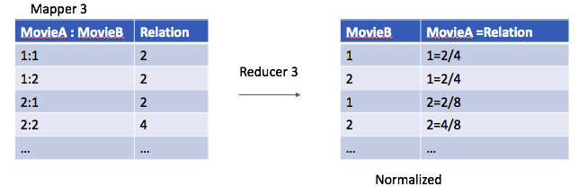   
Mapper: pass through. Input key=(movie1,movie2), value=total_occurance; output key=movie1, value=(movie2, total_occurance)  
PS: movie1 represents movie in the row, and movie2 represents movie in the column.   
Reducer: count the total occurance for each row and then divide each occurance with the total. Output key=movie2, value=(movie1, normalized_occurance, "relation")  
("relation" is a tag for the next MapReduce job to identify this tuple is relation between movies)
###### Caution
Things can go wrong here. Since what we are getting is based on the movies that each user rated. But there are movies that user doesn't rate. For those without ratings, we assign a "0.0" to it just in case we have all the values we want. (Maybe we don't have to do this step, but I failed without doing such.)  

###### Noted
For the next MapReduce job, we need two mappers, one for the relations between movies, another is to read in user ratings data (loaded in the first mapper) again to construct the movie rating vector for each user.   
In Java, we can specify two mapper in one MapReduce class.   
In python, I tried several times and I found that the mapper handling reading in user ratings data has to be a reducer_init in the 3rd MapReduce job so that it can pass the data along with the reducer in the 3rd MapReduce job. The data format for movie rating vector is key=movieId, value=(userId, float(rating), "rating").   
And the tag "rating" is indicating this value is for movie rating vector which is for the 4th MapReduce job which performs matrix multiplication  
##### Improvement
When reading in user rating data again, initially, we just pass through those movies with ratings and ignore those without ratings meaning those movies user didn't rate we give them a "0" rate.   
But this may cause a bias. We human may treat "0" as didn't watch, a neutral value. However, the system may think user doesn't like such movies at all.   
What neutral really means would be the average rating score over all movies that one user has rated. So in this process (while the current mapper reading in user rating data), we also assign a average rating score to those movies originally without rate and pass them through as well.
(pic of user rating vector)
##### 4th MapReduce Job
Input: key=movie2 (column), value=movie_relation_or_rating_list (each item in this list should have a tag, either "relation" or "rating") 
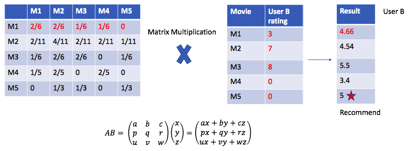  
 
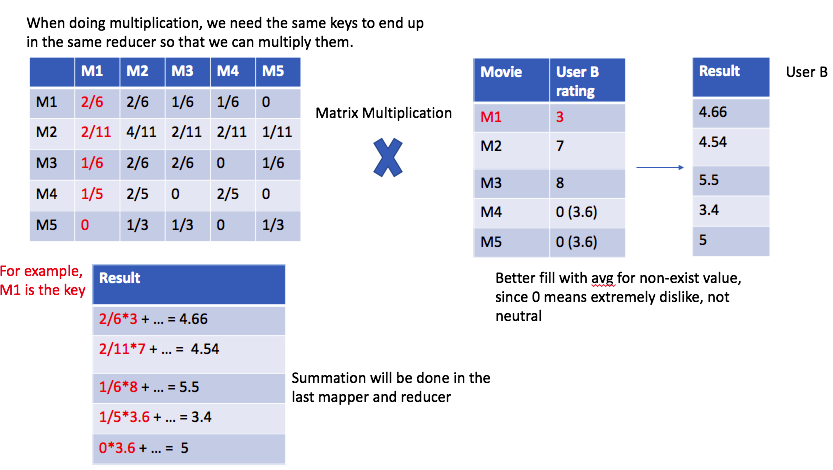  
In this 4th MapReduce job, mapper just passes through all it receives. 
Then in reducer, we used two dictionaries, one for user and his/her rating and the other one for movie1 and its relation/weight (those in rows). Then we use nested loops to loop through these two dictionaries and output key=(user, movie1), value=float(relation * rating) 

###### Notice
When talking about matrix multiplying a vector, the normal order of doing so would be each row vector in the matrix times the target vector.   
However, in MapReduce, even through we can set the movie in each row in the co-occurance matrix as key (key=M1, value=[M1,M2,...]), we cannot get all the movies in user rating vector in one reducer since they don't share the same key.   
(For example, for userA, we are using row movie M1 as key, key=M1, and we have to multiply [M1, M2,...] with the userA's M1,M2,... ratings but in fact we can only get userA's M1 in the same reducer.)
So we have to construct the multiplication as the way specified in 3rd and 4th MapReduce jobs.
##### 5th MapReduce Job
Input: key=(user, movie1), value=float(relation * rating)   
Mapper just passes through all data and not doing anything.   
Reducer sums up all the values under the key (user, movie1), in another word, sums up the result score for each movie for the specific user. 

###### TO DO
Now we have a txt result containing all scores for all users and all movies. I ran the result both in Docker + Hadoop and AWS. The final result file has almost 1Gb size. The next thing will be recommending k movies with top k (k could be 3) scores among those have never been watched by that user. The idea is, given a userId, we use a priorityQueue (min heap, in python, we only have max heap so we pass in negative score to make it work as min heap) with size k. Then loop through all movies under this userId, if the user didn't watch such movie and its score (absolute value) is bigger than the top one in the pq, we pop the top one in pq and add in the movie.

### Comments
Could also do cosine similarity and see which method gives better recommendation. One a single machine, if I do matrix multiplication directly, my machine ends up crashing while I ran MapReduce on Hadoop or AWS, I could get back result within an hour. The time could be shorten if I have money and use more and much powerful machines. But the idea is to show the power of parallel computing and data processing achieved by MapReduce.

## 2. MapReduce realization of PageRank Algorithm with visualization.
### PageRank Algorithm
(website relation picture - circle and links graph)
#### Equations
(picture)
Idea is to calculate the ranking matrix(vector, since it would be a N*1 matrix) iteratively. According to the paper of PageRank, approximately it needs 30-40 iterations to converge.

#### Transition matrix
(picture)

##### Work Flow
(picture)

##### Problems
(picture) 
1) Dead ends  
2) Spider traps  
As a human, when we see a website keeps directing to itself or cannot direct to any other pages, we would probably shut down the browser/close the page and open a new one. This new one means not going deeper by multiplying the transition matrix but instead, use the status from last iteration (PR(N-1)) as the start point, just like the first ranking matrix input PR(0).  
To simulate such behavior, we introduce a damping factor beta, meaning we have beta(in percentage) probability to re-open the website and come to a complete new start.  
We jump from equation PR(N) = PR(N-1) * Transition Matrix to the following:  
PR(N) = (1-beta)*PR(N-1)*Transition Matrix + beta * PR(N-1)

3) Memory limit  
When it comes to matrix multiplication, there's always a problem needs to be considered. Where to store the matrix? Especially in the case it involves iterations and intermediate results.  
Obviously it's not wise to store the whole matrix in place because the transition matrix is sparse (merely have a web connecting to all other webs). And it's too slow (probably crash) to perform matrix multiplication directly. Then we can consider an improvement of calculation: parallel computing using MapReduce. 
(picture) 
We divide the big matrix into small cells and do multiplication locally. And we cannot do the normal matrix multiplication (row times the vector) because they are in different keys in MapReduce. There's no way we can get the whole single row and the whole vector in the same reducer. For example:  
We need to calculate the first entries W1, then we need the row W1 in the transition matrix - key=W1, value=[W1, W2, ..., Wn], and the ranking matrix: [W1, W2, ..., Wn]T (being a n*1 vector). But if we use row entry as the key, list of each column entries as value, then in the same reducer (which takes the key=W1), we can only get the W1 in that vector.  
(may be picture here)  

### Data
Website transitions (websites that each website can link to)  
From  \t  To (separated by ",")  
webId1  \t  webId2,webId3,...  

Initial page rank (All webs are equally important initially) 
webId1 \t 1/N  
webId2 \t 1/N  
...  
N equals to total number of websites in the dataset.  

### MapReduce
We used 2 MapReduce jobs in total. Both of them have 2 mappers.  
###### 1) 1st MapReduce job:  
i) Mapper1 - parse the transition data  
Each line of the input is in the format of:  
from_web1 \t toweb1,toweb2,...  
For each "to" website of the list of toweb1,toweb2,...  
We output key="from" website, value="to" website=1/n, n being the total number of websites that "from" website can link to.  
ii) Mapper2 - parse the inital page rank data  
Each line of the input is in the format of:  
webId1 \t 1/N  
We simply output key=webId1, value=1/N, N being the total number of website in the dataset.  

iii) Reducer - calculating the rank - (1-beta)*PR(N-1)*Transition Matrix  
First we do a filter: if the value in the values list contains a "=" meaning it is the transition value and we store it into another list, otherwise it is the ranking value and we remember it by a variable.  
Then loop over the list of transition values, we output key=webId (key received by this reducer, which is the row entries in the matrix format (imagined)), value=(1-beta)*ranking value*transition value.  

###### 2) 2nd MapReduce job:  
i) Mapper1 - pass through data  
Just pass through the data from the previous reducer and not doing anything.  
ii) Mapper2 - parse the page rank data PR(N-1) (output of last iteration)  
Here we parse the page rank data from the output of last iteration just like we did in the second mapper of the 1st MapReduce job. 
But this time, the value in each line would be different. It maybe no longer be 1/N but some value with decimal. (1/N is only the value in the very inital state, it will change right after the iterative calculation starts)  
Each line of the input is in the format of:  
webId1 \t value(in decimal)  
Remember the reason we read in the ranking PR(N-1) of the last iteration is to have a complete fresh start with the probability of beta. So we have to multiply the value with the beta parameter.
We output in the same format as well, key=webId1, value=value*beta  
iii) Reducer - sum up the results for each row entry  
As the key being the row entry, the values we get is in the form of a list and we need to sum them up to get the final result of matrix multiplication for each row entry.  
We output key=webId, value=sum(input values received by this reducer) and this time, the output will write to a txt file marking as the result ranking PR(N) after the Nth iteration.  

(maybe adding the picture of cell matrix multiplication)
### To be updated
